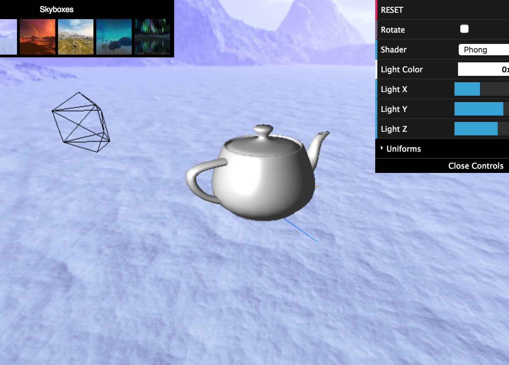

A graphics demo using Three.js and dat.GUI. Try out the demo or download the source and run it locally!

See the documentation for an overview of the implementation.

All skyboxes sourced from: [Custom Map Makers](http://www.custommapmakers.org/skyboxes.php)  

 
 

## Getting Started

To setup and modify the demo checkout the guidelines in [Getting Started](https://knvsl.github.io/teapot-demo/intro.html)

_______

## Useful Resources

Three.js  
[https://threejs.org/](https://threejs.org/)

dat.GUI  
[https://github.com/dataarts/dat.gui](https://github.com/dataarts/dat.gui)

A list of GLSL functions  
[http://www.shaderific.com/glsl-functions/](http://www.shaderific.com/glsl-functions/)  

Graphics tutorials covering many of the techniques used in the demo
[https://www.scratchapixel.com/](https://www.scratchapixel.com/)

OpenGL tutorials  
[http://www.opengl-tutorial.org/](http://www.opengl-tutorial.org/)
